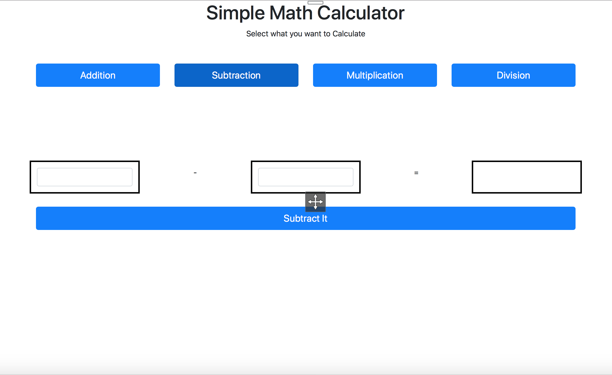

# Math 0.2 Tests

## What is in this Repository

In this repository i have test plan for the application found in [GlitchItSystem Website](https://glitchitsystem.com/qa-guide-to-web-application-testing-for-beginners-test-pages/).

## Acceptance Criterias

1. Webpage loads without any errors.
2. Webpage tab title is "Math 1.0"
3. Heading is "Simple Math Calculator"
4. Body text is "Select what you want to calculate"
5. Arithmetic problem is correct based on selection.
6. Numbers are bordered.
7. Button text changes based on selection.
8. Pressing button will solve the problem.
9. Math problem answer is always correct.
10. Design Matches Mockup.

## Tests
The tests can be found in [test folder](./tests).
Each acceptance criteria has a number and the file is the corresponding test.

## Tools used:
- Google Chrome
- Trello
